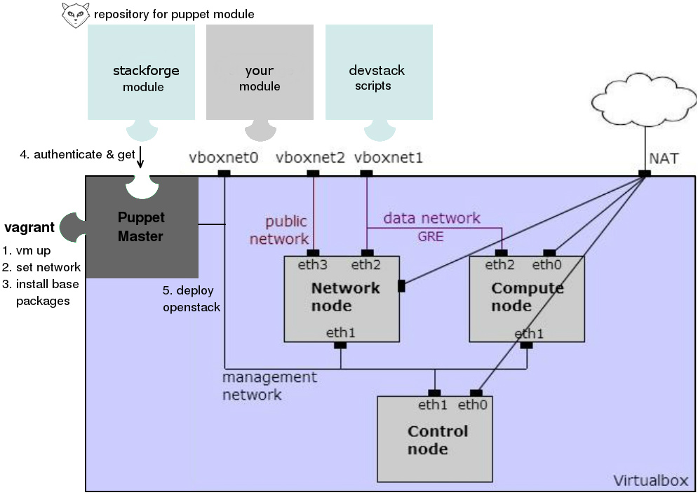

# Automat openStack ICEHOUSE deployment on vagrant for development & test system

This project mimics a multi nodes Openstack deployment within Virtualbox:
- Control, compute1-2, neutron1-2 nodes on different VMs
- Support [puppet manifests](https://github.com/trihoangvo/vagrant_openstack_puppet.git) to deploy openStack Icehouse.
  Networking: ML2 plugin, L2 population over GRE tunnel.
  Storage: iSCSI on control node.
- Support switching between 2 configurable environments: `puppet` and `devstack`.
- Support caching glance image & packages to reduce deployment time.
- Support a customized vagrant box to reduce the vagrant up time.
- Support remote debugging in devstack environment.

## 1. Prerequisites

- [Vagrant](http://vagrantup.com) 1.5.3 or higher
- [Virtualbox](https://www.virtualbox.org/wiki/Linux_Downloads) 4.2 or higher
- A fast internet connection. The system will download about 600MB of data over 
the Internets for the first deployment.

## Quick start

- After cloning the project, create a local config file from "config.yaml.example":
	
		$ cd vagrant_openstack; cp config.yaml.example config.yaml

- Set an environment to deploy openStack in config file, i.e puppet

		env: puppet

- Now you can list all VMs from within the project directory

		$ vagrant status
		Cache enabled: /home/tri/git/vagrant_openstack/cache
		Working on environment deployed by puppet branch icehouse...
		compute2.pp               disabled in config.yaml
		neutron2.pp               disabled in config.yaml
		Current machine states:
		puppet                    not created (virtualbox)
		control.pp                not created (virtualbox)
		compute1.pp               not created (virtualbox)
		neutron1.pp               not created (virtualbox)

- To start the environment, run "vagrant up"

		$ vagrant up
		Working on environment deployed by puppet branch icehouse...
		Bringing machine 'puppet' up with 'virtualbox' provider...
		==> puppet: Importing base box 'dtagcloud'...
		...
		notice: Finished catalog run in 55.95 seconds

- Or bring up an individual node and ssh to it

        $ vagrant up control.pp
        $ vagrant ssh control.pp

## 2. Design overview

For full description go to: http://alldistributedsystems.blogspot.de/2014/04/automat-opensack-deployment-on-vagrant.html

### 2.1 Networking

| Nodes        | Mgnt network  | Data GRE network  | Public network |
| ------------ |---------------| ----------------- | -------------- |
| Control      | 192.168.56.2  |                   |                |
| Compute 1    | 192.168.56.31 | 192.168.57.31     |                |
| Compute 2    | 192.168.56.32 | 192.168.57.32     |                |
| Neutron 1    | 192.168.56.41 | 192.168.57.41     | 192.168.58.4   |
| Neutron 2    | 192.168.56.42 | 192.168.57.42     | 192.168.58.4   |

### 2.2 Deployment environments

#### 2.2.1 Puppet

First a puppetmaster vm with puppetdb installed is up. It pulls puppet manifests 
from the config repo `puppet_giturl` to `/opt/deploy` inside the VM and use these
manifests to deploy openStack on the other VMs. OpenStack deployment completes 
on a VM when puppet agent logs out in `/var/log/syslog` as:

		notice: Finished catalog run in 158 seconds

By default puppet manifests are [provided here](https://github.com/trihoangvo/vagrant_openstack_puppet.git) to deploy openStack.
But you can also provide your own manifests by configuring your puppet repo and
which site.pp has the nodes definition to use:

		puppet_giturl: git@your.repository.git
		puppet_branch: your_branch
		puppet_site_pp: manifests/your_site.pp

In case your puppet repo in your company requires ssh to connect, you can provide
the config with a private id_rsa:

		git_auth_required: true
		git_id_rsa: files/id_rsa

#### 2.2.2 Devstack

No VM for puppet master is up. Insteads devstack is directly cloned and setup 
inside the VMs under `/home/vagrant/devstack`. OpenStack deployment completes 
on a VM when `stack.sh` logs out in `/home/vagrant/devstack/logs/stack.sh.log`:

		stack.sh completed in x seconds

or there are no stack.sh process found with

		pgrep -f stack.sh

## 4. FAQ

#### Can I switch between the environments?

- Yes. First suspend all current VMs, just in case so you want to resume them later

		$ vagrant suspend

- Edit the repository, i.e from `puppet` to `devstack`

		repository: devstack

- List the VMs in the new environment

		$ vagrant status
		Working on environment deployed by devstack branch master...
		...
		control.dev               not created (virtualbox)
		compute1.dev              not created (virtualbox)
		...

- Note that all VM names now have the suffix change from `.pp` to `.dev`. And 
you can bring i.e. a `control.dev` up

		$ vagrant up control.dev

#### What is the box TelekomCloud in the config?

It is a customized vagrant box, based on vagrant precise64. This box has:
- lastest VBoxGuestAdditions 4.3.8
- pre-installed puppet, dnsmasq, r10k, vim, git, lvm2, msgpack, rubygems
- pre-setup /etc/hosts, pydev/pysrc

to boost the vagrant up time. The box was already whiteout all logs and zeroout
all empty spaces to have a minimum size as possible (378 Mb).

#### What are cached?

- The image config under `cache_img_get` is download and cached for adding glance 
image again and again when you deploy openStack on control node.
- All .deb packages installed by puppet environment.
- All .pip packages installed by devstack environment.

Caching improves [deployment time significantly](http://alldistributedsystems.blogspot.de/2014/04/automat-opensack-deployment-on-vagrant.html)

#### How to clean cache?

Delete the folder `cache` that you specified under `cache_dir`

#### I want to ping floatingip 192.168.58.6 that was assigned to a fixed ip from my HOST machine

On the host machine run:

		ip route add 192.168.58.0/24 via 192.168.57.41 dev vboxnet1

This is a workaround to set a route to node neutron1. Here 192.168.57.41 is the 
ip of neutron1, but not in the same range as the floatingip 192.168.58.0/24.

#### How to remote debug openStack in devstack?
wip

## License

Copyright (C) 2014 Deutsche Telekom

Author: Tri Hoang Vo <vohoangtri@gmail.com>

Contributors: Willy Otto <w.otto@telekom.de>

Licensed under the Apache License, Version 2.0 (the "License");
you may not use this file except in compliance with the License.
You may obtain a copy of the License at

    http://www.apache.org/licenses/LICENSE-2.0

Unless required by applicable law or agreed to in writing, software
distributed under the License is distributed on an "AS IS" BASIS,
WITHOUT WARRANTIES OR CONDITIONS OF ANY KIND, either express or implied.
See the License for the specific language governing permissions and
limitations under the License.
